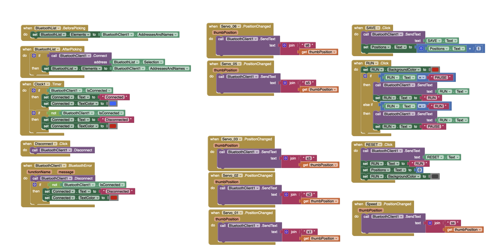
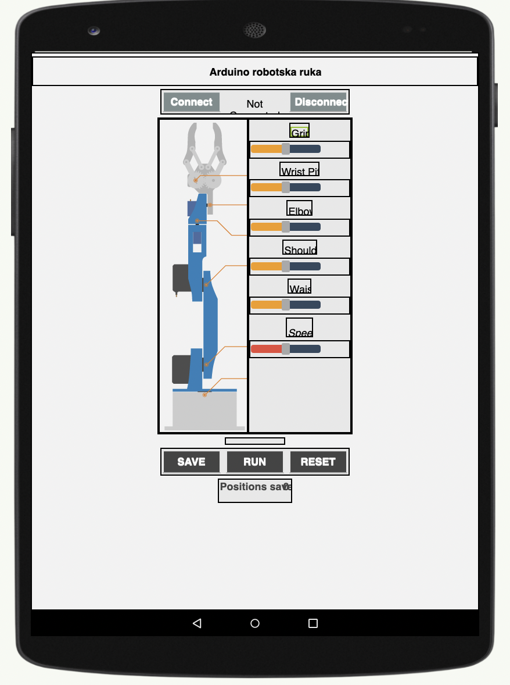
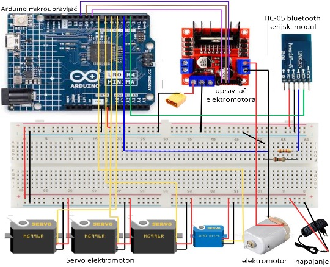
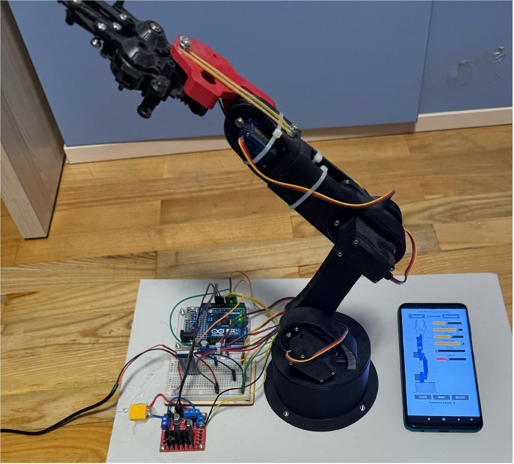

# Robotic Arm Arduino R4 Minima

Bluetooth-controlled robotic arm firmware for **Arduino UNO R4 Minima**, built with PlatformIO.

## Features
- 4 servo axes controlled by Bluetooth commands (`s1` to `s4`)
- Adjustable movement speed with `speed` command
- DC gripper control with `s5` command
- Compatible with MIT App Inventor Bluetooth app

## Project Structure
- `src/main.cpp` - firmware source code
- `platformio.ini` - PlatformIO board/environment config
- `docs/images/mit-app/` - MIT App Inventor screenshots
- `docs/images/hardware/` - robot, wiring, electronics images
- `docs/images/demo/` - optional demo photos/gifs

## Bluetooth Command Protocol
- `s1<0-180>` -> Servo 1 angle
- `s2<0-180>` -> Servo 2 angle
- `s3<0-180>` -> Servo 3 angle
- `s4<0-180>` -> Servo 4 angle
- `speed<1-100>` -> delay (ms) per movement step
- `s5<0-180>` -> gripper logic (`>100` open, `<80` close, otherwise stop)

Examples:
- `s190`
- `s245`
- `speed20`
- `s5120`

## MIT App Inventor (Bluetooth App)
Add your screenshots to:
- `docs/images/mit-app/blocks.png`
- `docs/images/mit-app/app-screen.png`

Then they will render here:




## Hardware
Add your hardware photos to:
- `docs/images/hardware/scheme.jpg`



## Demo
Add your demo image/video preview to:
- `docs/images/demo/robotic-arm.png`



## Build / Upload
Requires PlatformIO CLI or PlatformIO IDE extension.

```bash
platformio run
platformio run --target upload
```

## Notes
- Firmware currently drives servos without `Servo.h` (manual pulse generation).
- Bluetooth serial is configured on pins `3` (RX) and `4` (TX).
